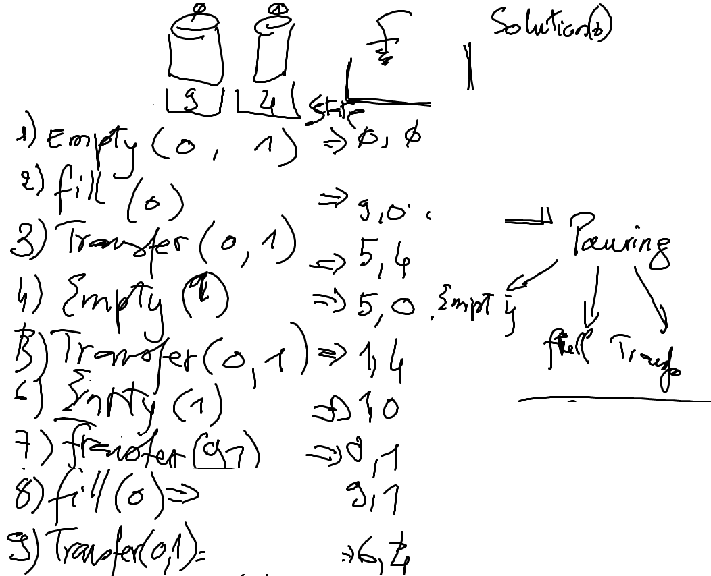

# Data Structure

https://twitter.github.io/scala_school/collections.html

# Eau

https://www.youtube.com/watch?v=q6M_pco_5Vo

## Example




---

Solutions.scala
```Scala
object Solutions {

  def main(args: Array[String]): Unit = {
    // 9oz et 4oz verres
    val problem = new WaterPouring(Vector(9,4))

    // Solution si la solution recherchee est de 6oz
    problem.solutions(6).foreach(println)

  }

}
```
