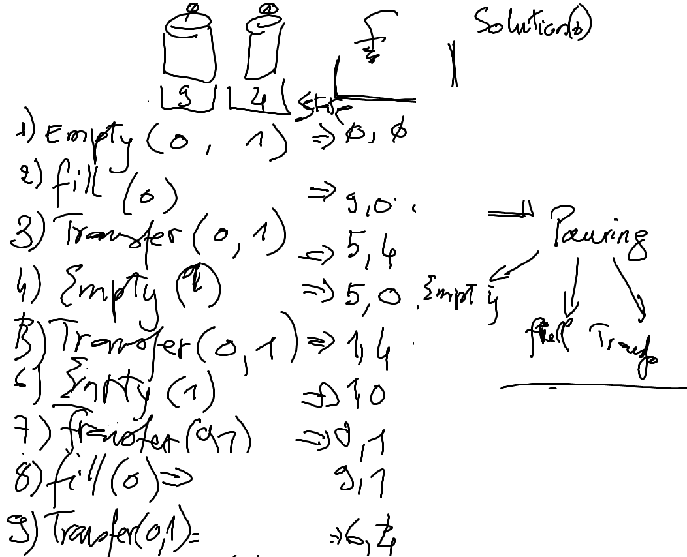

# Data Structure

https://twitter.github.io/scala_school/collections.html

# Eau

https://www.youtube.com/watch?v=q6M_pco_5Vo

## NP-Completude Algorithme

https://www.gerad.ca/~alainh/NP-completude.pdf

## Devoir

Avec les connaissances que vous avez aujourd'hui, imprimer les solutions du probleme ci-dessous.



[![alt text][2]][1]

  [1]: https://meta.stackoverflow.com/users/44330/jason-s
  [2]: https://www.gravatar.com/avatar/dd57e..dfd07?s=128&d=identicon&r=PG (hover text)


---

Solutions.scala
```Scala
object Solutions {

  def main(args: Array[String]): Unit = {
    // 9oz et 4oz verres
    val problem = new WaterPouring(Vector(9,4))

    // Solution si la solution recherchee est de 6oz
    problem.solutions(6).foreach(println)

  }

}
```
