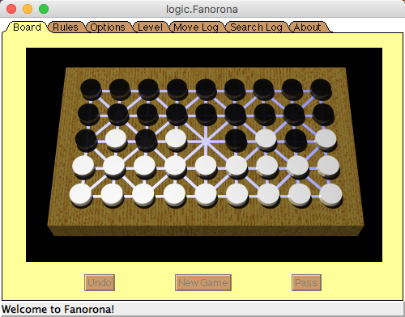
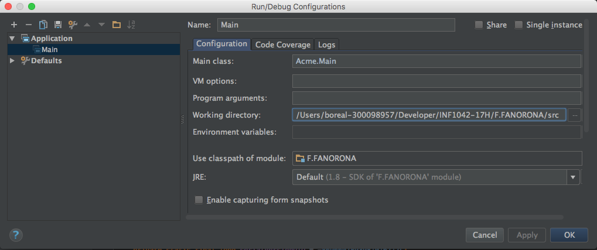

# Fanorona

## Faire tourner le programme

Assurez vous que vous pointez sur le répertoire src pour utiliser les images

## Guide du Développeur

Fanorona is written in Java. Its UI Component is an Applet and mostly uses AWT;
- A StackLayout is a LayoutManager that arranges components in a vertical (or horizontal)  
- A [64 BitSet](docs/Fanorona Bits Explanation.xls) allowing Data Representation and Manipulation of the board. 
- A Tree Game Search using the [Alpha-Beta](https://chessprogramming.wikispaces.com/Alpha-Beta) Pruning search implementing: 
    * a mini-max evaluation
    * a Transposition Table
    * an Aspiration Search
    * an Internal Iterative Deepening [IID](https://chessprogramming.wikispaces.com/Internal+Iterative+Deepening)
    * an alpha-beta enhancement called Principal Variation
    * a - Memory Test Driver reducing the calculation time. MTD(f)    

## Some other Tree Search Documentation

* [Strategy and board game programming](http://www.ics.uci.edu/~eppstein/180a/w99.html)  - David Eppstein's Courses at UCI - Lecture notes April 22, 1997  
* [Alpha-Beta Search](http://www.ics.uci.edu/~eppstein/180a/970422.html)  - David Eppstein's Courses at UCI  
* Recherche arborescente Bruno Bouzy - Universite Rene Descartes [Fixed-depth Minimax Tree Search](http://www.math-info.univ-paris5.fr/~bouzy/Doc/AA2/Minimax-AlfaBeta-Bouzy.pdf)

## Tasks

- UI and Search Engine Separation

